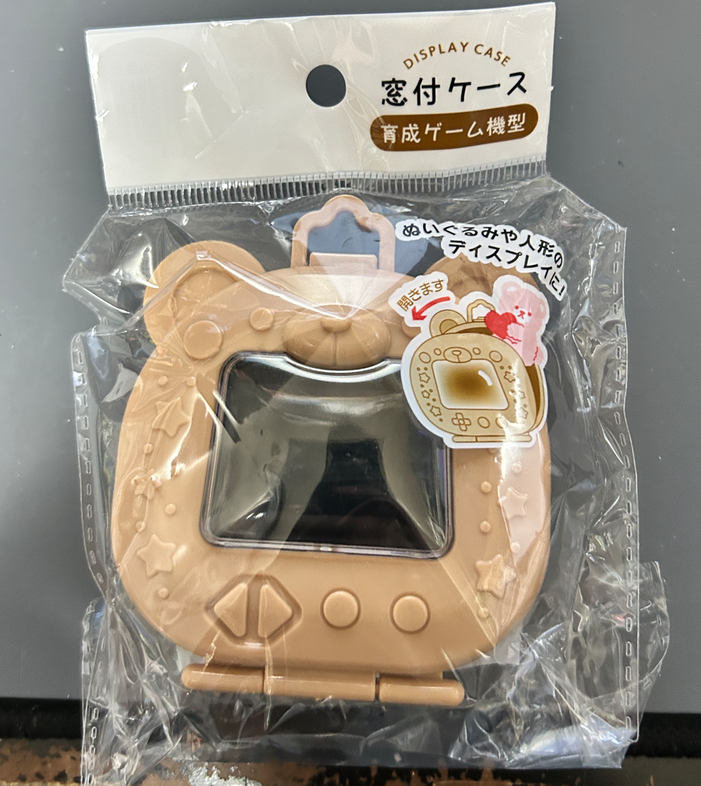
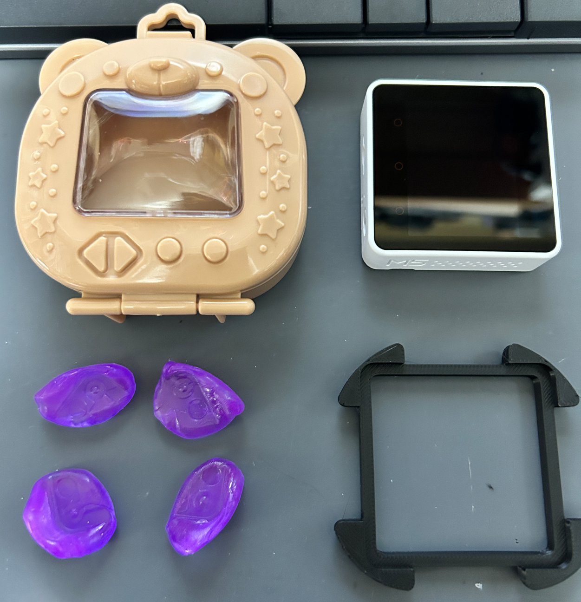
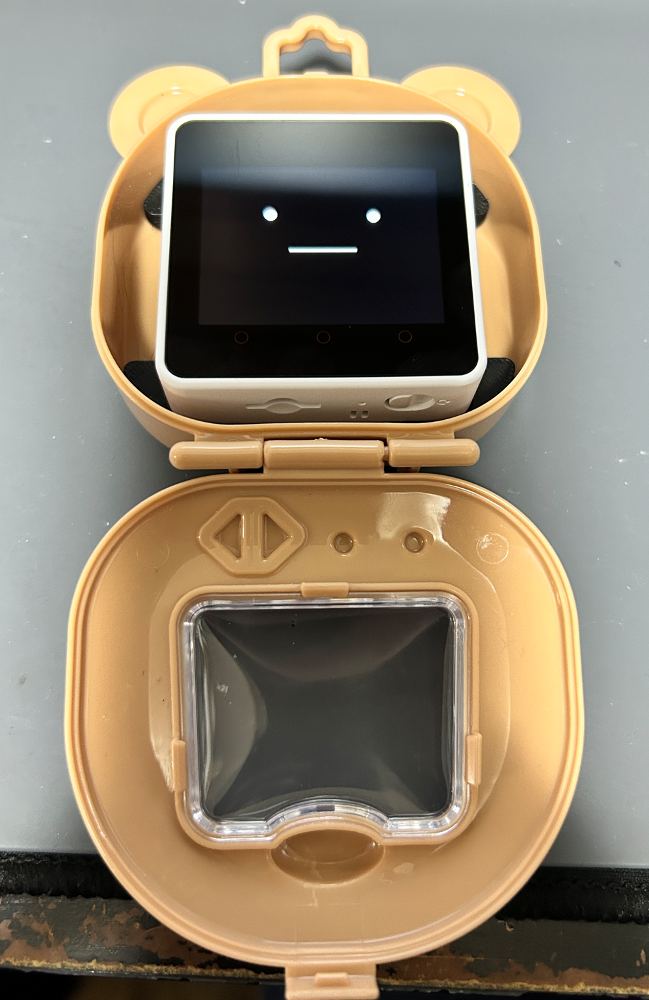
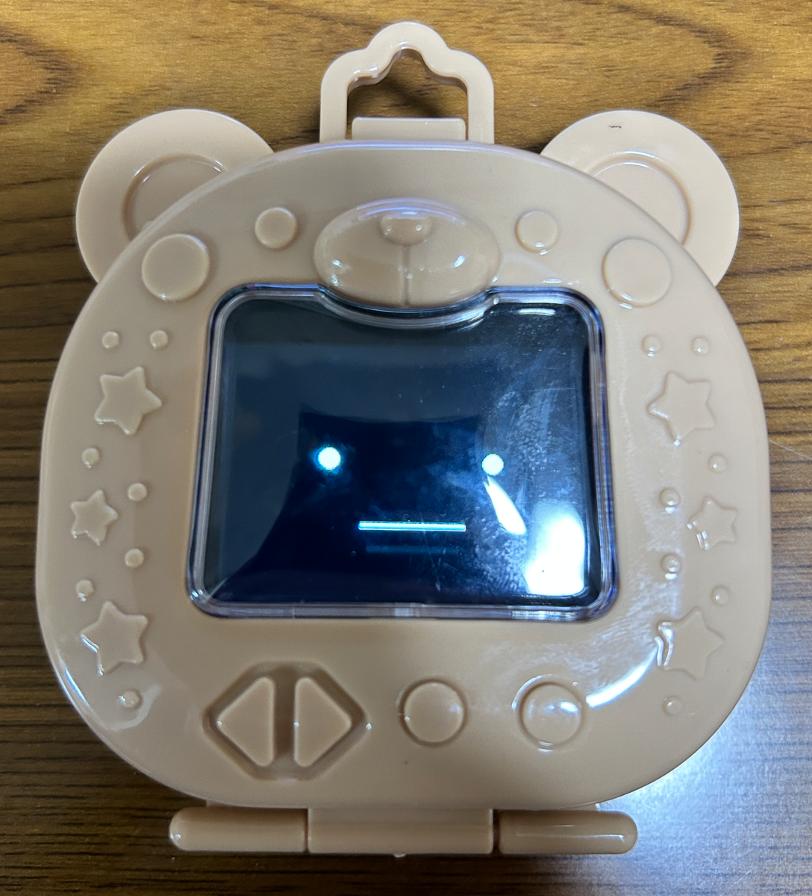

# M5Unified Avator
セリアで、M5Stackシリーズにピッタリのケースを見つけました。

M5Stackの固定は、プラスティックねんどおゆまるで簡易的に固定することもできますが、3Dプリンタでスペーサーをつくりました。（右下）

写真はCore2ですが、BASICあたりでも大丈夫だと思います。（たぶん）

ジャストフィット！です。

ソフトはvscodeのplatformioの環境から、@meganetaaanのm5stack-avatarを利用させてもらい、顔の座標のみ調整しました。

https://github.com/meganetaaan/m5stack-avatar